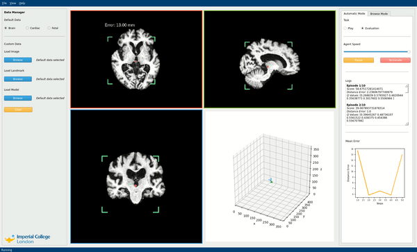
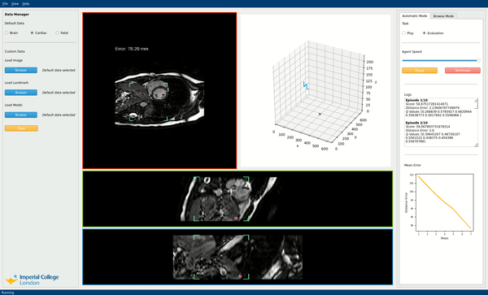
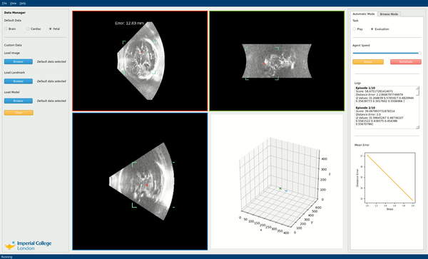

# **A**natomical **L**andmark **D**etection and **D**emonstration **I**nterface 

*ALADDIN* is a platform offering automated solutions for the detection of human anatomical landmarks using Reinforcement Learning (RL) agents, complete with a unified visualisation suite. The tool can be used by medical professionals within image analysis, or for RL algorithmic experiments by machine learning researchers.

This project is forked from following repository:
```
https://github.com/amiralansary/rl-medical.git
```

## Installation

### Dependencies
+ Python=3.8
+ [cycler=0.10.0](https://pypi.org/project/Cycler/)
+ [tensorflow-gpu=1.14.0](https://pypi.org/project/tensorflow-gpu/)
+ [tensorpack=0.9.5](https://github.com/tensorpack/tensorpack)
+ [opencv-python](https://pypi.org/project/opencv-python/)
+ [pillow](https://pypi.org/project/Pillow/)
+ [gym](https://pypi.org/project/gym/)
+ [SimpleITK](https://pypi.org/project/SimpleITK/)
+ [PyQt5](https://pypi.org/project/PyQt5/)
+ [ipython](https://pypi.org/project/ipython/)
+ [matplotlib](https://pypi.org/project/matplotlib/)

### Installation Procedure
Follow the following steps (in order) to install required dependencies.
1. Clone this repository
2. ``` cd rl-medical ```
3. ``` pip install -r requirements.txt ```
4. ``` pip install -U git+https://github.com/amiralansary/rl-medical.git ```

## Run Code
Follow the following steps (in order) after installing **all** required packages to run GUI or DQN.  

**Note**: the main product is the GUI; DQN serves as a backend for training and logging models. Before running DQN script, keep in mind that a model is usually trained for at least 2 days and requires GPU.
- To view the main product with pre-trained model follow **GUI**   
- To train your own model/ view detailed logs follow **DQN**

*Please email one of us or our supervisor if you have any issues with code execution.*

### GUI

GUI allows running, visualising, and evaluating the performance of (already trained) RL agents in locating landmarks on medical imaging datasets (*Brain*, *Cardiac*, *Fetal*).

1. Open ```Terminal```
2. Go to the [main directory](examples/LandmarkDetection/DQN) by using the command ```cd examples/LandmarkDetection/DQN```
3. Run the GUI by using the command ```python controller.py```
4. For further instruction on how to use the GUI, open 'Application Help Window' on the GUI through the 'Help' menu on the GUI.

### DQN

DQN allows expert to train and evaluate RL models with different hyperparameter choices using a basic DQN implementation, HITL, and Transfer Learning extensions.

1. Open ```Terminal```
2. Go to the [main directory](examples/LandmarkDetection/DQN) by using the command ```cd examples/LandmarkDetection/DQN```
3. Run the command depending on usage and extensions used (see subsections below). For more information about options and flags, see usage documentation below.

##### Train
```
 python DQN.py --task train --algo DQN --gpu 0 --files './data/filenames/image_files.txt' './data/filenames/landmark_files.txt' --type {'BrainMRI', 'CardiacMRI', 'FetalUS'} --HITL {True, False}
```

##### Transfer Learning Train
```
python DQN.py --task train --algo DQN --gpu 0 --files './data/filenames/brain_train_files_new_paths.txt' './data filenames/brain_train_landmarks_new_paths.txt' --type 'BrainMRI' --HITL False --transferModel data/models/ CNN FC
```

##### Evaluate
```
python DQN.py --task eval --algo DQN --gpu 0 --load data/models/ './data/filenames/image_files.txt' './data/filenames/landmark_files.txt' --type {'BrainMRI', 'CardiacMRI', 'FetalUS'}
```

##### Test
```
python DQN.py --task play --algo DQN --gpu 0 --load data/models/ --files './data/filenames/image_files.txt' --type {'BrainMRI', 'CardiacMRI', 'FetalUS'}
```

```
usage: DQN.py [-h] [--gpu GPU] [--load LOAD] [--task {play,eval,train}]
              [--algo {DQN,Double,Dueling,DuelingDouble}]
              [--files FILES [FILES ...]] [--saveGif] [--saveVideo]
              [--logDir LOGDIR] [--name NAME][--type {'BrainMRI', 'CardiacMRI', 'FetalUS'}]
              [--HITL {True, False}] [--transferModel MODEL_PATH [VARIABLE_GROUPS ...]]

optional arguments:
  -h, --help            show this help message and exit
  --gpu GPU             comma separated list of GPU(s) to use.
  --load LOAD           load model
  --task {play,eval,train}
                        task to perform. Must load a pretrained model if task
                        is "play" or "eval"
  --algo {DQN,Double,Dueling,DuelingDouble}
                        algorithm
  --files FILES [FILES ...]
                        Filepath to the text file that comtains list of
                        images. Each line of this file is a full path to an
                        image scan. For (task == train or eval) there should
                        be two input files ['images', 'landmarks']
  --saveGif             save gif image of the game
  --saveVideo           save video of the game
  --logDir LOGDIR       store logs in this directory during training
  --name NAME           name of current experiment for logs
  --type                type of dataset can be either 'BrainMRI', 'CardiacMRI', or 'FetalUS'
  --HITL                flag to indicate (for training) to use HITL.
                        In order to run in HITL mode, the required training files need to
                        be included to load human experience on the human experience buffer.
  --transferModel       To use transfer learning you specify the argument --transferModel which
                        as argument takes the path to a model followed by and optional list
                        of variable groups to transfer after the path. Specifying no groups will
                        transfer everything.

                        The variable groups are (as specifed in the report)
                        1. CNN: all convolutional layers
                        2. FC: all fully connected layers
                        3. FC_intermediate: All fully connected layers excluding the final one
                        4. FC_final: Only the final fully connected layer

                        You can also specify which variables that should be trainable by the argument
                        --trainable as trainable groups in any combo of variable groups from above (i.e.)
                        --trainable CNN FC will train everything and is the default value
                        --trainable FC will only train variable group FC and so on
```

## Results

Here are few examples of the learned agent for landmark detection on unseen data displayed on the GUI:

* Detecting the anterior commissure (AC) point in adult brain MRI
<p align="center">

</p>

* Detecting the apex point in short-axis cardiac MRI
<p align="center">

</p>

* Detecting the cavum septum pellucidum (CSP) point in fetal head ultrasound
<p align="center">

</p>

## Folder Structure

For description of main directory folder structure, click [here](folder_structure.md).

## Authors
- **Alexander Gaskell**: aeg19@imperial.ac.uk
- **Maleakhi A. Wijaya**: maw219@imperial.ac.uk
- **Faidon Mitzalis**: fm1710@imperial.ac.uk
- **Olle Nilsson**: oen19@imperial.ac.uk
- **Harry Coppock**:
hgc19@imperial.ac.uk
- **James Dorricott**: jd3114@imperial.ac.uk

## Supervisor
- **Amir Alansary**: a.alansary14@imperial.ac.uk

## Citation

If you use this code in your research, please cite these paper:

```
@article{alansary2019evaluating,
  title={{Evaluating Reinforcement Learning Agents for Anatomical Landmark Detection}},
  author={Alansary, Amir and Oktay, Ozan and Li, Yuanwei and Le Folgoc, Loic and
          Hou, Benjamin and Vaillant, Ghislain and Kamnitsas, Konstantinos and
          Vlontzos, Athanasios and Glocker, Ben and Kainz, Bernhard and Rueckert, Daniel},
  journal={Medical Image Analysis},
  year={2019},
  publisher={Elsevier}
}
 ```
